# 🦞 每日 Agent 简报

<p align="center">
  
</p>

<p align="center">
  <b>面向 AI Agent 从业者和学习者的每日简报工具</b><br>
  检索 → 四维分析（信息/洞察/利益/启示）→ 3:4 HTML 卡片（含 SVG 图形）
</p>

<p align="center">
  
  
  
</p>

---

每日 AI 简报生成器。搜到信息后按四维拆解，输出可传播的 3:4 HTML 卡片。支持单事件和融合分析两种模式。

## 工作流

```
选题 → 拆检索词 → AnySearch 检索 → 四维分析 → 生成 HTML 卡片
```

### Step 1 — 选题

每日扫描 AI 热点，或指定主题。方向：模型发布、工具更新、融资动态、论文突破、政策监管。

### Step 2 — 拆检索词

每个选题拆成 2-3 个检索词。例如"Claude 新功能"：

- `Claude Anthropic new features 2025`
- `Claude API update latest`
- `Claude vs GPT benchmark 2025`

### Step 3 — 检索

```bash
# JSON 模式（供分析）
bash scripts/agent-search.sh "<检索词>" <条数> <语言> [tag] json

# 可读模式
bash scripts/agent-search.sh "<检索词>" <条数> <语言> [tag]
```

### Step 4 — 四维分析

| 维度 | 问什么 |
|------|--------|
| 📰 信息 | 发生了什么？谁说的？关键数字？ |
| 🔍 洞察 | 话里有话？反映什么趋势？ |
| ⚖️ 利益 | 谁受益？谁承压？谁观望？ |
| 💡 启示 | 然后呢？对我意味着什么？ |

**两种模式：**
- **单事件** — 一条消息独立出卡
- **融合分析** — 多来源合并到一张卡，每项标注来源

### Step 5 — 生成 HTML 卡片

3:4 竖版，主次布局（35% 主区 + 65% 次区）。参考模板：[analysis-card-template.html](references/analysis-card-template.html)

**主题色系统：** 蓝（模型）/ 红（政策）/ 橙（融资）/ 紫（论文）/ 青（行业整合）

## 快速开始

```bash
# 1. 克隆
git clone https://github.com/wp931120/agent-intel.git
cd agent-intel

# 2. 设置 API Key
export ANYSEARCH_API_KEY="as_sk_xxxxxx"

# 3. 检索
bash scripts/agent-search.sh "Claude Sonnet 4 features" 10 en general.general json

# 4. 查看卡片模板
open references/analysis-card-template.html
```

> 💡 免费注册获取 API Key：[AnySearch Console](https://www.anysearch.com)

## 脚本参数

```bash
bash scripts/agent-search.sh "<query>" [max_results] [language] [tag] [mode]
```

| 参数 | 说明 | 默认值 |
|------|------|--------|
| `query` (必填) | 搜索查询 | — |
| `max_results` | 返回结果数 (1-20) | 10 |
| `language` | `en` / `zh-CN` | `en` |
| `tag` | 能力标签 | `general.general` |
| `mode` | 输出模式：`normal` / `json` | `normal` |

### Tag 选择指南

| Tag | 适合场景 |
|-----|---------|
| `general.general` | 通用新闻资讯 |
| `code.doc` | 技术文档、API 参考 |
| `academic.search` | 学术论文检索 |
| `code.snippet` | 开源代码搜索 |
| `finance.news` | 公司动态、融资 |
| `social_media.social_media` | 社区讨论热度 |

完整 tags：[tags.md](references/tags.md)

## 目录结构

```
agent-intel/
├── SKILL.md                              # OpenClaw Skill 主文件
├── scripts/
│   └── agent-search.sh                   # AnySearch 搜索封装
├── references/
│   ├── tags.md                           # AnySearch Tags 参考
│   └── analysis-card-template.html       # HTML 卡片参考模板
├── assets/
│   └── logo.svg                          # Logo
├── CHANGELOG.md
├── README.md
└── .gitignore
```

## 依赖

- `curl` — HTTP 请求
- `python3` — JSON 解析
- `jq` (可选) — JSON 构建

## 许可证

MIT
